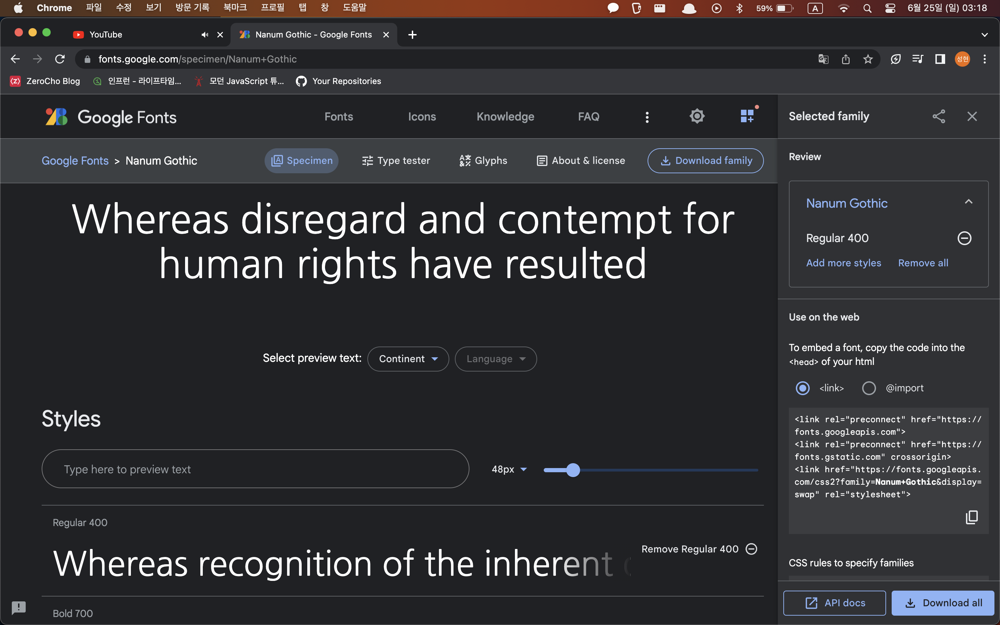

# 글꼴 관련 스타일

들어가기전에 [기본형] 표기 방식에 대해 이해합시다

1. `|`는 나열한 옵션 중 하나가 값이 되어야 한다는 의미

`font-size: 값1 | 값2 | 값3`

2. 속성 값을 나열할 때 키워드(약속한 값)는 그대로 나열

`font-variant: normal | small_caps

3. 속성 값을 나열할 때 값이 아니라 유형이라면 꺾쇠 괄호(<, >)로 묶는다. 이 때 다른 속성을 유형처럼 사용할 수 있다.

`font-size: <절대 크기> | <상대 크기> | <크기> | <백분율>

-> <백분율>은 값이 아니라 유형, 따라서 font-size: 30%라고 사용 가능

<br>

`font: <font-style><font-variant><font-weight>`

-> font-style 속성 값을 font 속성 값으로 사용한다.

## font-family: 글꼴 지정하기

`font- family: <글꼴이름>[,<글꼴 이름>, <글꼴 이름>]>`의 형태

대괄호는 옵션임. 있으면 적용하고 없으면 기본 값으로 들어가는 애들

<br>

`p { font-family: "굴림"; }`

속성 값은 주로 큰 따옴표를 사용. `맑은 고딕` 같은 띄어쓰기가 포함된 글꼴은 `"맑은 고딕"` 같은 식

<br>

웹 문서에서 글꼴을 지정할 때는 한 가지 글꼴만 지정하기도 하지만 지정한 글꼴이 없을 경우에 대비해 두 번째, 세 번째 글꼴까지 지정함

`body { font-family: "맑은 고딕", 돋움, 굴림}` 이런 식

<br>

## @font-face: 웹 폰트 사용하기

웹 문서를 작성할 때 글꼴 정보도 함께 저장했다가 사용자가 웹 문서에 접속하면 글꼴을 사용자 시스템으로 다운로드 시키는 방식

https://fonts.google.com 에서 나눔 고딕을 다운로드 받아서 넣어보자



<br>

오른쪽에 `<link>`든 `@import`든 원하는거 복사해서 사용하면 됨

```html
<style>
	@import url('https://fonts.googleapis.com/css2?family=Nanum+Gothic&display=swap');
	.ng-font {
		font-family: 'Nanum Gothic';
	}
	p {
		font-size: 30px;
	}
</style>

<p>브라우저 기본 글꼴</p>
<p class="ng_font">나눔 고딕 웹 폰트 사용</p>
```

이런 식

<br>

## font-size: 글자 크기 조절하기

`font-size: <절대 크기> | <상대 크기> | <크기> | <백분율>`

주로 `<크기>` 값을 직접 지정해서 사용함

<br>

- 절대 크기: 브라우저에서 지정한 글자 크기, `xx-small`, `x-small`, `small`, `medium` ... `xx-large` 까지 있음
- 상대 크기: 부모 요소의 글자 크기(font-size)를 기준으로 더 크게 표시하거나 더 작게 표시한다. 사용할 수 있는 값은 `larger`, `smaller`
- 크기: 브라우저와 상관없이 글자 크기를 조절
- 백분율: 부모 요소의 글자 크기를 기준으로 해당하는 %를 계싼해 표시

<br>

`<크기>` 값을 지정하는 방식

- em: 해당 글꼴의 대문자 M으리 너비를 기준으로 크기를 조절
- ex: x-height. 해당 글꼴의 소문자 x의 높이를 기준으로 크기를 조절
- px: 픽셀. 모니터에 따른 상대적 크기
- pt: 일반 문서에서 많이 사용하는 단위

rem 같은것들도 있는데 이건 나중에 나옴

### px 단위 사용하기

주로 `px`를 많이 사용하는데, 이 경우 폰트 크기가 고정되기 때문에 창 크기가 작은 모바일 기기로 볼 때도 같은 크기로 화면에 표시된다.

결국 작은 화면에 작은 글씨로 표시되므로 모바일 기기에서 접속ㅎ라 경우까지 고려한다면 `px` 단위보다 `em` 단위를 사용하는 것이 좋다.

? 근데 1em이 16px 아닌가

<br>

### em 단위 사용하기

`em`은 사용하는 글꼴의 대문자 M을 기준으로 한다 부모 요소에서 지정한 폰트의 대문자 M의 너비를 1em으로 놓고 상대적 값을 계산해 다른 요소들의 글자 크기를 조정한다.

만약 지정한 크기가 없다면 <body> 요소의 크기 16px이 기본 값 1em으로 지정된다.

```html
<style>
	h1 {
		font-size: 3em;
	}

	p {
		font-size: 1em;
	}
</style>

<body>
	<h1>3em의 크기를 가진 제목</h1>
	<p>1em의 크기를 가진 제목</p>
</body>
```

<br>

## font-weight: 글자 굵기 지정하기

`font-weight: noral | bold | bolder | lighter | 100 | 200 | ... | 900`

사용하는 속성 값

1. normal: 기본 값
2. bold | lighter | bolder: 말 그대로
3. 100 ~ 900 사이의 숫자: normal: 400, 숫자가 커길 수록 굵어짐

<br>

## font-variant: 작은 대문자로 표시하기

대문자를 소문자 크기에 맞춰 표시하는 것

`font-variant: normal | small-caps`

<br>

## font-style: 글자 스타일 지정하기

글자를 이탤릭 채로 표시하는 것

`font-style: normal | italic | oblique`

italic: 이탤릭 체가 따로 있는 것
oblique: 기본 설정된 글꼴을 기울임

대부분 italic 씀

<br>

## font: 글꼴 속성을 한꺼번에 묶어 표시하기

`font: <font-style><font-variant><font-weight><font-size/line-height><font-family> | caption | icon | menu | message-box | small-caption | status-bar`

뒤에 옵션들은 그것에 어울리는 글꼴 스타일로 표시되게 하는 것

menu: 드롭다운 메뉴에 어울리는 글꼴 스타일
status-bar: 상태 표시줄에 어울리는 글꼴 스타일
...

이런 식

```html
p { font: 16px/25px "맑은 고딕"} <!-- font-size: 16px/ line-height: 25px, font-family: "맑은 고딕" -->
p { font: bold italic 12pt } <!-- font-style: bold font-variant: italic font-size: 12pt -->
p { font: 120%/120% bold } <!-- font: font-size:120% line-height:120% font-weight: bold -->
```