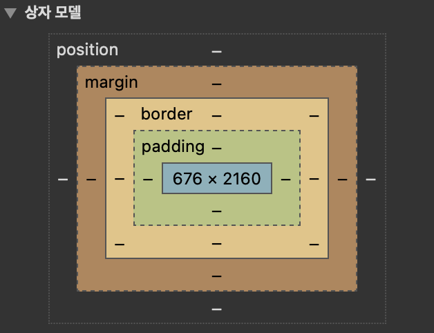

s## 박스모델

개발자 도구를 열고 Elements 탭으로 간다.

아무 태그나 눌러서 Style을 눌러본다.

이런 그림이 나온다.

`position`, `margin`, `border`, `padding`, `content` 순으로 나온다.(content는 파란색 네모임)

이게 박스 모델이다.

**content**

보통 태그가 차지하는 공간이 content이다.

**padding**

요소 내의 여백이 padding이다.

스크롤 바는 padding 공간 내에 생긴다.

**border**

테두리이다.

padding이 없어도 border는 있을 수 있다.

- 주의! 따로 명시를 하지 않았다면 padding과 border 모두 width와 height에 포함되지 않는다.

`box-sizing:border-box`를 주게 된다면 width와 height는 content뿐만 아니라 border까지 포함한 요소의 크기가 된다.

`box-sizing`의 기본 값은 `content-box`임.

**margin**

다른 태그와의 거리를 나타낸다. 요소 바깥의 여백임. width / height에 포함되지 않는다.

- 정리

1. 태그에는 content, padding, border, margin이 있음.
2. (한꺼번에 입력할 때) up, right, down, left 순으로 속성 값을 정해줄 수 있다.
3. padding과 border, margin은 width에 포함되지 않는다.

예외) `box-sizing:border-box`를 걸어주게 된다면 margin을 제외하고 포함한다.
